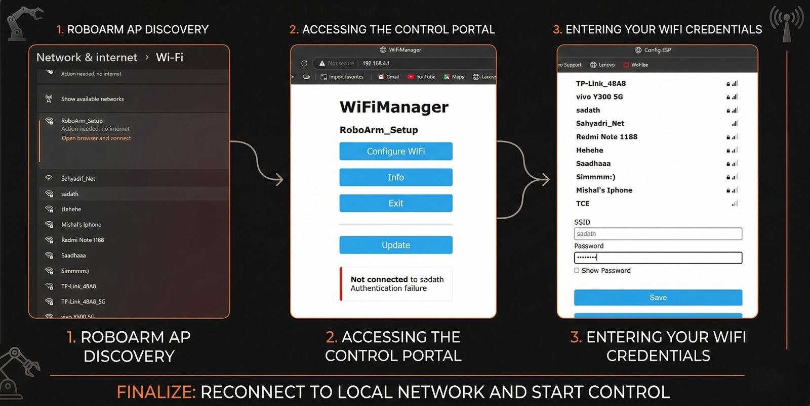
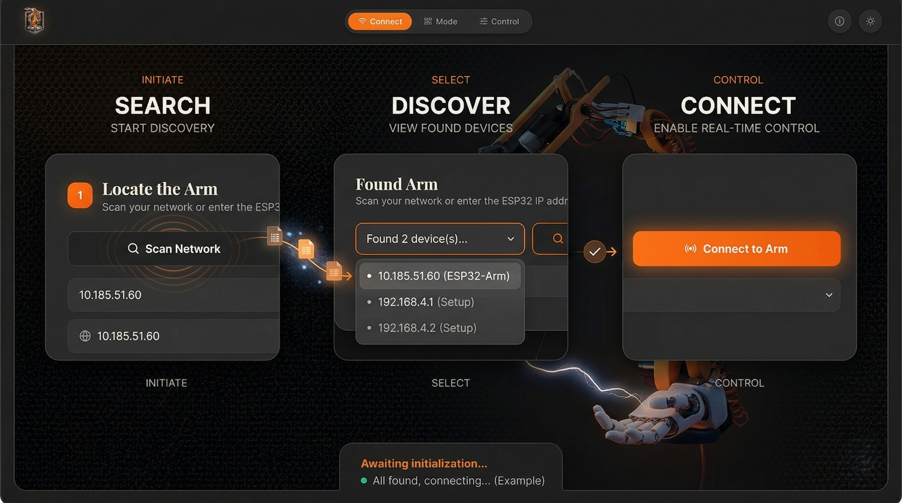
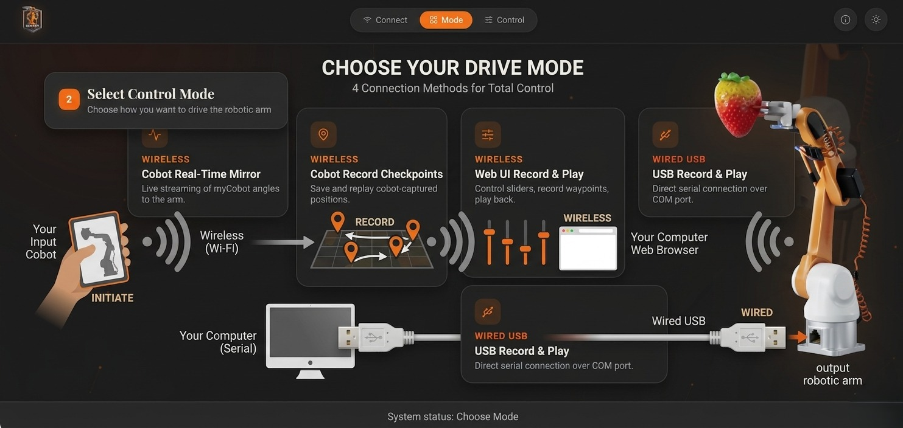
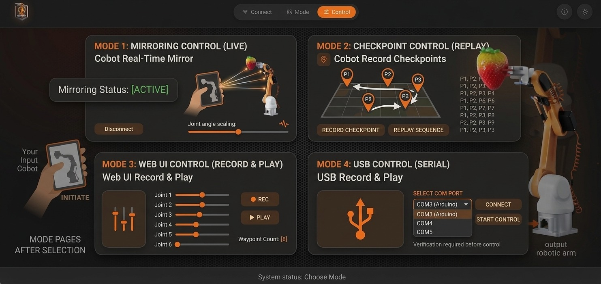

# 🤖 ArmFlow: Imitation Learning Robotic Arm

**ArmFlow** is a multi-mode robotic arm control platform that enables teleoperation, kinesthetic teaching, and autonomous imitation learning via a beautifully designed, browser-based interface.

With this system, you can control a custom 6-axis robotic arm using an intuitive web dashboard or by physically manipulating a "master" robot (a myCobot) while the target arm mimics its movements in real-time.

---

## 📋 Product Requirements Document (PRD)

### 1. Problem Statement
Building, controlling, and training a robotic arm typically requires complex programming and dedicated physical controllers. For tasks requiring imitation learning (teaching robots by showing them what to do), there's a need for an easy-to-use, flexible interface that supports diverse control methodologies without requiring coding knowledge from the end-user.

### 2. Core Objectives
*   Provide a single, unified "Control Hub" to manage a robotic arm.
*   Support multiple ways of demonstrating movements (Web UI vs. Physical Master Robot).
*   Enable effortless recording of trajectories and playing them back (the foundation of imitation learning).

### 3. Key Features
*   **Intelligent Auto-Discovery**: Automatically scan the local Wi-Fi network to find the robotic arm without manually typing IP addresses.
*   **Multi-Mode Control**:
    *   **Wired USB Control**: Direct, low-latency control via a USB cable.
    *   **Wireless Web UI**: Control over Wi-Fi using on-screen virtual sliders. Record waypoints and play them back.
    *   **Wireless Teleoperation (Live Mirror)**: Physically move a master robot (myCobot), and the target arm flawlessly mimics its movements in real-time.
    *   **Kinesthetic Teaching**: Record physical keyframes using the master robot and save the sequence to memory for playback.
*   **Dynamic Speed Modulation**: A safety-first approach allowing users to adjust the physical interpolation speed dynamically on the fly.

---

## 🏗️ System Logic & Architecture

The system mimics a biological nervous system, divided into three main components:

### 1. The Brain (Flask Hub - `app.py`)
This runs on a central computer (PC, Raspberry Pi, etc.). It serves the gorgeous frontend Web UI. Behind the scenes, it manages network connections, records memory frames, scales/translates angles from the master robot, and packages them into a standard data format.

### 2. The Nervous System (Network / Serial)
*   **UDP (Wi-Fi)**: Used for wireless control. UDP is lightweight and extremely fast, perfect for streaming real-time angles without bottlenecking.
*   **Serial (USB)**: A fallback tethered connection for absolute maximum reliability when testing in challenging network environments.

### 3. The Muscle (ESP32 Firmware - `controller.ino`)
The ESP32 receives a simple comma-separated string `(Base, Shoulder, Elbow, WristPitch, WristRoll, Gripper, SpeedDelay)`. It maps these 0-180 degree angles into hardware PWM pulses and interpolates the motors toward their target to prevent jerky, dangerous movements based on the dynamic `SpeedDelay`.

---

## 🛠️ Technology Stack

### Hardware Components
*   **Microcontroller**: ESP32 (Handles Wi-Fi, Web Server, mDNS, and Serial communication).
*   **Servo Driver**: PCA9685 I2C 16-Channel 12-bit PWM Servo Driver.
*   **Actuators**: 6x Standard Servos (MG996R or similar) for the 6 joints.
*   **Master Robot (Optional)**: Elephant Robotics myCobot 280 (acts as the physical teaching tool).

### Software Stack
*   **Backend (Python)**:
    *   `Flask`: Powers the web server and API endpoints.
    *   `socket` & `ping3`: Used for highly concurrent local network IP scanning to auto-discover the arm.
    *   `pyserial`: Manages wired USB communication.
    *   `pymycobot`: Interfaces with the physical master robot.
*   **Frontend (Web)**:
    *   Vanilla HTML5, CSS3, JavaScript.
    *   No heavy UI frameworks; uses custom lightweight glassmorphic CSS, dynamic aurora animations, and an interactive particle system.
    *   Lucide Icons for scalable, modern vector graphics.
*   **Firmware (C++)**:
    *   Arduino core for ESP32.
    *   `WiFiManager`: Handles initial Wi-Fi setup via a captive portal so hardcoding network credentials is not required.
    *   `Adafruit_PWMServoDriver`: Communicates with the PCA9685 board over the I2C protocol.

---

## 🚀 Step-by-Step Setup Guide

Follow these sequential instructions to get your Imitation Learner up and running.

### Step 1: Hardware Assembly & Firmware
1.  **Wiring the Brain box**:
    *   Connect the PCA9685 Servo Driver to the ESP32 using I2C:
        *   `SDA` -> `GPIO 21`
        *   `SCL` -> `GPIO 22`
        *   `GND` -> `GND`, `VCC` -> `3.3V`
    *   Plug your 6 servos to channels 0 through 5 on the PCA9685.
    *   **Crucial:** Provide a dedicated external 5V/6V power supply to the PCA9685 `V+` terminal. Do not power servos directly from the ESP32 or the board will instantly reboot when servos request power.
2.  **Flashing the ESP32 Firmware**:
    *   Open `controller.ino` in the Arduino IDE.
    *   Use the Library Manager (`Ctrl+Shift+I`) to install two libraries:
        *   `Adafruit PWM Servo Driver Library`
        *   `WiFiManager` (by tzapu)
    *   Select your ESP32 board and upload the code via USB.
3.  **Wi-Fi Headless Onboarding**:
    *   Power on the ESP32. If it cannot find a known network, it will generate its own Wi-Fi hotspot named **`RoboArm_Setup`**.
    *   Connect to this Wi-Fi network using your smartphone or laptop. A portal page will pop up automatically.
    *   Select your home Wi-Fi and enter the password. The ESP32 will reboot, connect to your router, and announce itself on the network (`roboarm.local`).

### Step 2: Running the Master Hub Software
1.  Ensure you have **Python 3.8+** installed on your master computer (PC, Mac, or Raspberry Pi).
2.  Open your terminal, navigate inside the `ArmFlow` directory, and install dependencies:
    ```bash
    pip install flask pyserial ping3 pymycobot
    ```
    *(Note: The `pymycobot` library is only strictly necessary if you intend to use the physical master robot for teleoperation, but it's safe to install regardless).*
3.  Launch the web server application:
    ```bash
    python app.py
    ```
4.  Wait for the terminal to output: `🚀 Master Hub Started!`. Open your modern web browser (Chrome, Safari, Edge) and navigate to `http://localhost:5000`.

### Step 3: Operating the System (Imitation Learning)
1.  **Phase 1: Connect**
    *   Open the Web UI on your computer or tablet.
    *   Click **Scan Network** to automatically find the ESP32. It should populate in the dropdown.
    *   Select the device and click **Connect to Arm**.
2.  **Phase 2: Mode Selection**
    *   Choose your desired teaching paradigm:
        *   **Web UI Record & Play**: Best for testing & virtual programming. Use on-screen sliders to pose the arm.
        *   **Cobot Real-Time Mirror**: Best for 1-to-1 live teleoperation. Move the master arm with your bare hands, and the target arm follows instantly.
        *   **Cobot Record Checkpoints**: Best for physical imitation training. Physically pose the master arm, record that pose, and build out an entire motion path.
3.  **Phase 3: Teach & Play**
    *   Adjust the global **Movement Speed** slider anytime. A lower value (e.g. `10ms`) means the joints will actuate faster; higher (e.g. `35ms`) means safer, slow continuous movement.
    *   In the Control Panel, manipulate the arm (via UI or physical cobot) to a desired starting position. Click **Snap Waypoint** (or **Save Checkpoint**) to store it in transient memory.
    *   Repeat this to build a chronological sequence of complex movements inside the **Recorded Memory** database.
    *   Click the green **Play Memory** button to command the target robotic arm to autonomously execute the sequence you just taught it!

---

## 📸 Visual Connection Walkthrough

These four diagrams illustrate exactly how the ESP32, your computer, and the web interface work together — from the very first power-on all the way through to full imitation-learning control.

---

### 🔌 Image 1 — ESP32 First-Time Wi-Fi Setup (Captive Portal)



This image shows the **one-time Wi-Fi configuration process** that the ESP32 goes through when it boots up for the very first time (or after a factory reset). You never need to hardcode your Wi-Fi password into the firmware — the `WiFiManager` library handles this automatically using a web-based captive portal.

**What is happening in each panel:**

**Panel 1 — RoboArm AP Discovery:**
When the ESP32 powers on and finds no known Wi-Fi network saved in its flash memory, it immediately creates its own temporary Wi-Fi hotspot (Access Point) named **`RoboArm_Setup`**. On Windows, your phone or laptop will show it in the available networks list just like any other Wi-Fi signal. The label "Action needed, no internet" is expected — this is a private local network for setup only, not the internet.

**Panel 2 — Accessing the Control Portal:**
Connect to `RoboArm_Setup`, then open your browser and navigate to `http://192.168.4.1`. The `WiFiManager` library serves a built-in configuration webpage at this address automatically. You will see four buttons: **Configure WiFi**, **Info**, **Exit**, and **Update**. Click **Configure WiFi** to scan for nearby networks and enter your credentials.

**Panel 3 — Entering Your Wi-Fi Credentials:**
The portal shows a live list of all nearby Wi-Fi networks (SSIDs). Tap your home or lab network — the SSID field auto-fills. Type your password and click **Save**. The ESP32 immediately reboots, connects to your router as a normal device, and registers itself as `roboarm.local` using mDNS. From this point on, every future boot reconnects automatically. You will never need to repeat this process unless the ESP32 is factory-reset.

> **Final step (bottom banner):** After saving, reconnect your laptop back to your normal home/lab Wi-Fi. The ESP32 is now a standard device on your local network, reachable at `roboarm.local` or its assigned IP address (e.g. `192.168.1.45`).

---

### 🔍 Image 2 — Web UI: Step 1 — Search, Discover & Connect



This image shows the **Step 1: Connect** screen of the ArmFlow web interface, and illustrates the complete 3-phase sub-flow (Search → Discover → Connect) that happens inside the first card when you open `http://localhost:5000`.

**What is happening in each column:**

**Column 1 — INITIATE: Search (Start Discovery):**
The user clicks **Scan Network**. Behind the scenes, the Flask `app.py` spawns a `ThreadPoolExecutor` with up to 50 workers and uses the `ping3` library to simultaneously send ICMP pings to every address in the subnet (e.g., `10.185.51.1` through `10.185.51.254`). For each address that responds, it also calls `socket.gethostbyaddr()` to resolve a human-readable hostname. This parallel approach completes a full 254-IP scan in just a few seconds. The IP field (`10.185.51.60`) shows the address the scan found.

**Column 2 — SELECT: Discover (View Found Devices):**
Once the scan finishes, a dropdown populates with every live device found. In this example, the scan found three entries: `10.185.51.60 (ESP32-Arm)` — the connected robotic arm — and two `192.168.4.x (Setup)` entries, which are ESP32 boards still broadcasting their first-time `RoboArm_Setup` access point (see Image 1). The user selects `10.185.51.60 (ESP32-Arm)` from the list, and the IP text input auto-fills.

**Column 3 — CONTROL: Connect (Enable Real-Time Control):**
With the correct IP confirmed, the user clicks the orange **Connect to Arm** button. ArmFlow calls the `/api/locate` endpoint, which sends a live ping to verify the device is truly reachable and responsive. On success, the frontend advances automatically to Step 2 and the status bar at the bottom displays a green confirmation dot with a success message.

---

### 🧭 Image 3 — Web UI: Step 2 — Choose Your Drive Mode



This image is a **system-level architecture diagram overlaid on the Mode Selection page**. It shows the complete physical data path for each of the 4 control modes — making it immediately clear how a signal travels from the user's input, through the computer, across the network, and into the target robotic arm.

**The 4 modes with their complete data paths:**

| # | Mode Name | Full Data Path | Best Use Case |
|---|---|---|---|
| 1 | **Cobot Real-Time Mirror** | Hand → myCobot joints → Serial/USB → Flask (`cobot_thread`) → UDP (port 5005) → ESP32 → PCA9685 → Servos | Fluid live teleoperation |
| 2 | **Cobot Record Checkpoints** | Hand → myCobot joints → Flask saves to `saved_moves[]` → On Playback: UDP → ESP32 → Servos | Building a task sequence physically |
| 3 | **Web UI Record & Play** | Browser slider → `ui_move` HTTP GET → Flask → UDP → ESP32 → PCA9685 → Servos | Virtual programming without hardware |
| 4 | **USB Record & Play** | Browser slider → `ui_move` HTTP GET → Flask → `pyserial` write → USB → ESP32 → PCA9685 → Servos | Zero-latency tethered control |

**Understanding the diagram's arrows:**
*   **Left side (Input Cobot):** The myCobot master arm is held by the user. Moving its joints generates raw angle data that the `pymycobot` Python library reads over serial every 50ms in a background thread.
*   **Center top (Wi-Fi arrows):** Modes 1, 2, and 3 all route their final 7-value data packet wirelessly to the ESP32 via UDP on port `5005`. UDP is used (over TCP) because it has no handshake overhead — perfect for real-time streaming where a dropped frame is better than a delayed one.
*   **Bottom USB cable:** Mode 4 bypasses Wi-Fi entirely. Data travels over a physical USB-serial connection at 115200 baud. When this mode is activated, Flask sends a special `SYS:WIRED` command to the ESP32 first, which instructs it to shut off its Wi-Fi radio and listen only on Serial — freeing up resources and maximizing reliability.
*   **Right side (Output Arm):** All 4 modes ultimately end here — the ESP32 receives the angle string, parses it, and drives each servo smoothly through one-degree steps using the PCA9685 PWM driver.

---

### 🎮 Image 4 — Web UI: Step 3 — All 4 Control Panels in Detail



This image shows **what Step 3: Control Panel looks like for all four modes simultaneously**. Each quadrant shows a different panel, with different controls that match the teaching method of that mode.

**Mode 1 — Mirroring Control (Live) — Top Left:**
*   The **"Mirroring Status: [ACTIVE]"** label confirms the background `cobot_thread` in `app.py` is alive and sending data every 50ms.
*   The **Joint angle scaling** slider is a multiplier. At center position it's 1:1 — the output arm copies the master arm exactly. Move the slider left to reduce the range of motion (safer for a smaller target arm), or right to amplify small master movements into large target movements.
*   The **Disconnect** button sets `is_playing = True` which pauses the send loop, effectively halting the live stream without killing the thread.
*   This is pure, unrecorded, real-time teleoperation — most useful for tasks requiring continuous fluid motion.

**Mode 2 — Checkpoint Control (Replay) — Top Right:**
*   The **visual grid map** provides a spatial overview of all saved checkpoints (P1, P2, P3, etc.) plotted as pin markers. This makes it easy to see the sequence at a glance.
*   The **Record Checkpoint** button calls the `/api/action?cmd=record_cobot` endpoint, which reads the `current_cobot_payload` variable (the last received myCobot angles from the background thread) and appends it as a new entry to `saved_moves[]`.
*   The **Replay Sequence** button iterates through `saved_moves[]` and sends each angle packet to the ESP32 one at a time, with a 2.5-second pause between each — giving the physical arm time to physically travel to each pose before moving on.
*   The angle data list on the right shows each saved frame's raw values. This mode is the **core of kinesthetic imitation learning**: you show the robot what to do by physically demonstrating it, and it stores and reproduces that demonstration autonomously.

**Mode 3 — Web UI Control (Record & Play) — Bottom Left:**
*   Six labeled **virtual slider controls** appear for all articulations: Joint 1 (Base), Joint 2 (Shoulder), Joint 3 (Elbow), Joint 4 (Wrist Pitch), Joint 5 (Wrist Roll), and Joint 6 (Gripper).
*   Dragging any slider triggers an `oninput` JavaScript event that immediately calls `/api/ui_move` over HTTP with the updated angle array. Flask forwards this packet to the ESP32 over UDP. The physical arm responds in near real-time.
*   The **REC button** (red dot icon) saves the current slider positions as one waypoint frame in `saved_moves[]`. The **Waypoint Count: [8]** counter shows 8 poses have been stored in this example.
*   The **PLAY button** replays the full sequence. This mode lets you perform imitation learning entirely in software — no physical master arm required.

**Mode 4 — USB Control (Serial) — Bottom Right:**
*   A **SELECT COM PORT** dropdown auto-populates with available serial ports (`COM3`, `COM4`, `COM5`). Users select the port their ESP32 is assigned to (check Windows Device Manager → Ports if unsure).
*   **CONNECT** opens the serial port with `pyserial` at 115200 baud and sends the `SYS:WIRED` handshake string to the ESP32. The ESP32 firmware recognises this string, shuts down its Wi-Fi radio, and switches to serial-only mode.
*   **START CONTROL** is only enabled after a successful connection, ensuring the serial port is confirmed open before sending any movement commands.
*   The note "Verification required before control" is a deliberate safety gate — sending servo commands before the handshake would result in the ESP32 trying to parse garbage data, potentially causing erratic servo behaviour.

---

*Created as part of the Imitation Learner Project framework.*
